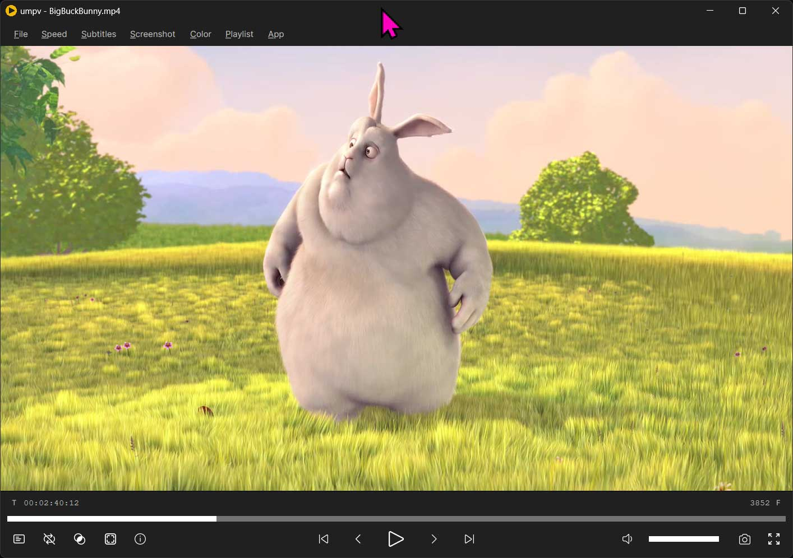
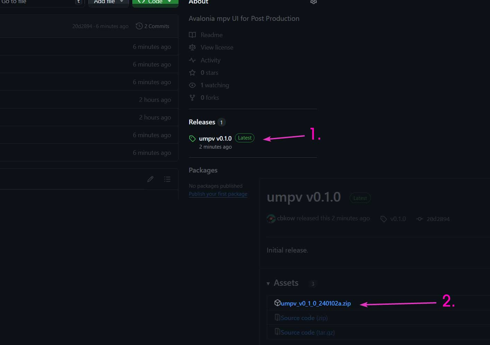
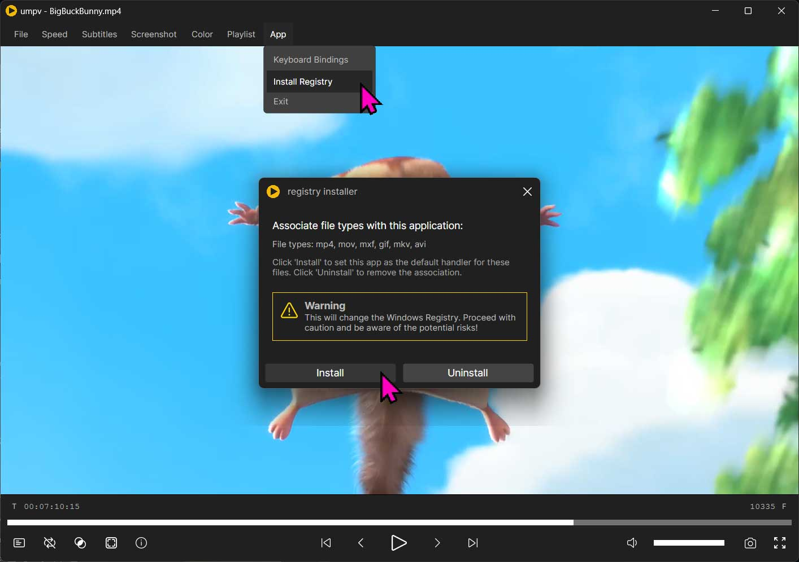
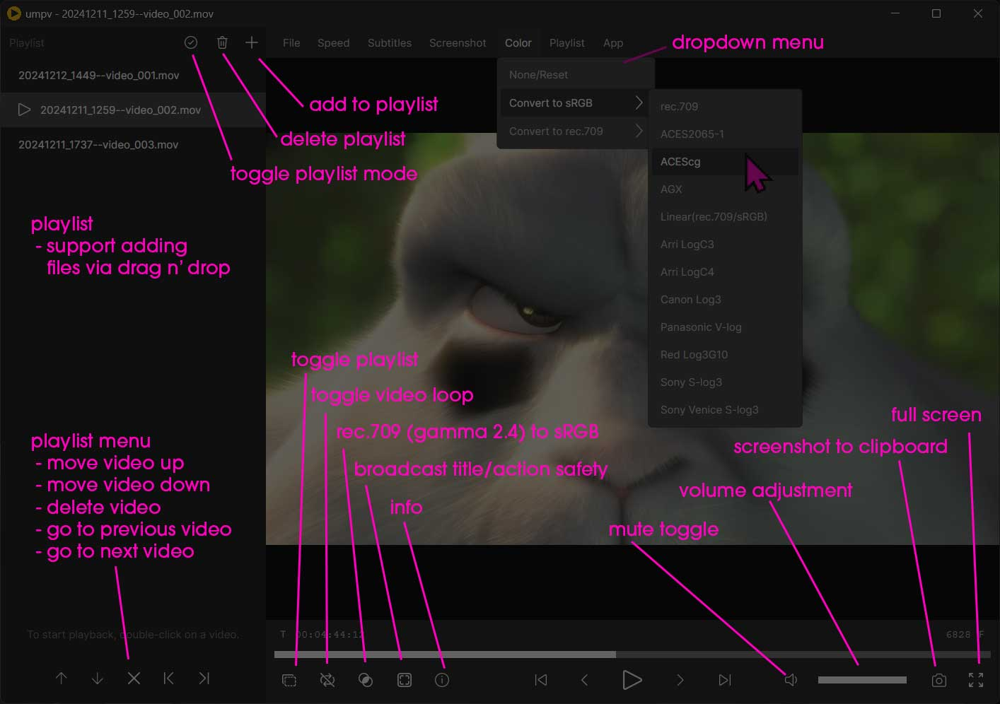
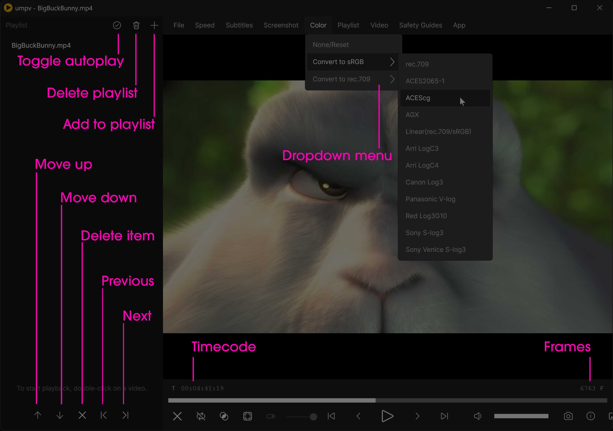
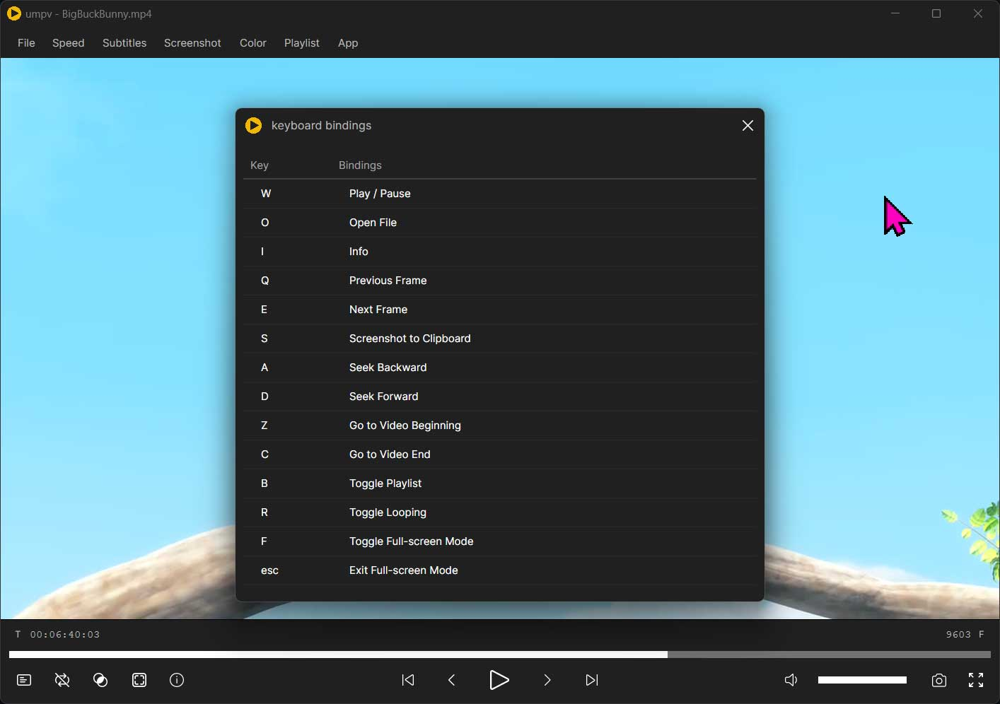
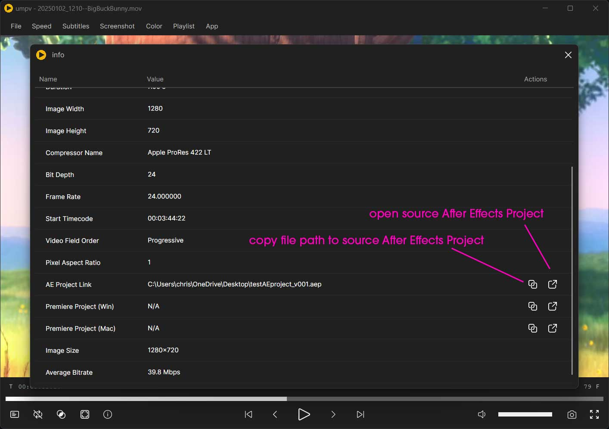

# umpv

**umpv** is a user-friendly interface for **mpv**, specifically designed as a simple video player for postproduction. No installation is necessary—just download the latest release and launch umpv.exe.

Including:
- Drag and drop video loading.
- Simultaneous time and frame count readouts.
- Frame or second video shuttling for granular review. 
- Keyboard bindings for various playback buttons.
- Fullscreen mode without any UI.
- Easy rec.709(gamma 2.4) to sRGB conversion and a menu with various LUTs for typical CG and Camera color space conversions (experimental). 
- Broadcast title/action safety guides for the latest ISO in 16:9 deliveries.
- Exiftool metadata, including the ability *to find and open source After Effects and Premiere projects* with Adobe's custom metadata.
- Can save video screenshots to the Windows clipboard or your Desktop.
- A custom playlist that bypasses mpv's playlist and handles the ordering programmatically--allowing reordering, and on-the-fly additions/subtractions.

## Installation

Download the latest release, unzip, and open umpv.exe. (Keep all the files included together in the provided hierarchy.)

## Advanced Installation (experimental)

This app function will run a Powershell script that adds the necessary registry entries to include umpv in the Window "Open With" menu. It also adds legacy Windows 10 file associations for .mp4, .mov, .mxf, .gif, .mkv, and .avi files.

## Credits

**umpv** is a UI built around [Shinchiro's build](https://github.com/shinchiro/mpv-winbuild-cmake) of [libmpv](https://mpv.io/). Phil Harvey's excellent [Exiftool](https://exiftool.org/) allows for metadata parsing and, more importantly (for us), the ability to find Adobe metadata and open projects.

## Basic Usage

## Contributing and Disclaimers.

The app is fully functional, but the source code could be much cleaner. Although I have experience in scripting, I don't have much experience in app development, so I leaned heavily on several LLMs for guidance. The main page view is a testament to that—it reads like a giant, messy script. I plan to clean that up in later versions with more regard to the MVVM app structure—breaking off much of the functionality into separate controls and helpers. 

It's worth noting that this implementation of Avalonia + libmpv has one huge flaw, which I currently have to work around with a messy hack. When no video is loaded, it renders a transparent hole to the desktop and background apps. I haven't yet found a way to change that behavior, so I am rendering an additional black window behind the video player window and hiding it from the Window's taskbar and alt-tab functions. It follows the sizing and positioning of the main view well and doesn't impact performance in a measurable way, but there are a few moments where it is noticeable. You will see it if you toggle the playlist on/off a few times in rapid succession. 

I am certainly open to suggestions and contributions, but remember that this app is created for personal use. Hence, you are better off forking it and making changes for yourself. But if you do fork it and do something clever or fix something janky, please let me know. I am particularly interested in a MacOS Arm port--which is theoretically possible with a few changes to the window positioning/tracking (Windows-specific implementation), screenshot functions (Also currently Windows-specific), and a few things I am forgetting.

One more thing: The app is slow to load the first time you use it but loads fast in subsequent runs. I have this problem with other Avalonia apps, and I am also looking into it. 

## Build Notes

Before you build, download the latest [mpv-dev-x86_64-v3 from here](https://sourceforge.net/projects/mpv-player-windows/files/libmpv/), and extract `libmpv-2.dll` to `source\UnionMpvPlayer\Assets`.