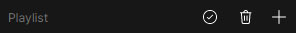
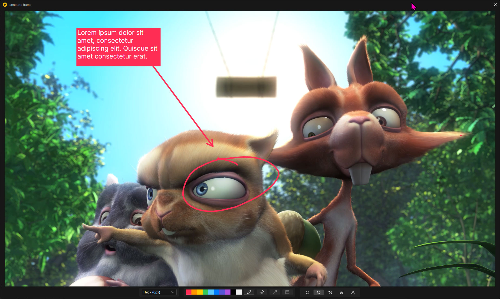

# umpv

**umpv** is a user-friendly interface for **mpv** on Windows, specifically designed as a simple video player for postproduction. No installation is necessary—just download the latest release and launch umpv.exe.

Including:

- Drag and drop video loading.
- Simultaneous time and frame count readouts.
- Frame or second video shuttling for granular review. 
- Keyboard bindings for various playback buttons.
- Fullscreen mode without any UI.
- Easy rec.709(gamma 2.4) to sRGB conversion and a menu with various LUTs for typical CG and Camera color space conversions (experimental). 
- Broadcast title/action safety guides for the latest ISO in 16:9 deliveries.
- Exiftool metadata, including the ability *to find and open source After Effects and Premiere projects* with Adobe's custom metadata.
- Can save video screenshots to the Windows clipboard or your Desktop.
- A custom playlist that bypasses mpv's playlist and handles the ordering programmatically--allowing reordering, and on-the-fly additions/subtractions.
- Basic frame annotation and note tools with export options.

## Installation

Download the latest release, unzip, and open umpv.exe. (Keep all the files included together in the provided hierarchy.)

## Advanced Installation (experimental)

`App > Install Registry`

This app function will run a Powershell script that adds the necessary registry entries to include umpv in the Window "Open With" menu. It also adds legacy Windows 10 file associations for .mp4, .mov, .mxf, .gif, .mkv, and .avi files.

## Credits

**umpv** is a UI built around [Shinchiro's build](https://github.com/shinchiro/mpv-winbuild-cmake) of [libmpv](https://mpv.io/). Phil Harvey's excellent [Exiftool](https://exiftool.org/) allows for metadata parsing and, more importantly (for us), the ability to find Adobe metadata and open projects. I am using [OpenEXR](https://openexr.com/en/latest/index.html) to parse layers and channels in multi-layer EXRs and (for now) [OpenImageIO](https://github.com/AcademySoftwareFoundation/OpenImageIO) to extract a single layer EXR for playback in [libmpv](https://mpv.io/). [Pandoc](https://pandoc.org/) and [wkhtmltopdf](https://wkhtmltopdf.org/) are used to export PDFs from video notes.

## Basic Usage

|Command| Description |
|---|---|
|`File > Open *`|Mainly intended for video playback, umpv will also load image sequences. Multipass EXR loading is possible with an OIIO cache generation. This cache render is a stopgap solution until I can develop a better way.|
|`Speed`|Video playback speed adjustments|
|`Subtitles`|Load subtitles|
|`Screenshot`|Screenshots to desktop or the Windows clipboard|
|`Color`|Color space conversion LUTs including ACES, AGX, and some common cameras. These LUTs were created with ociotools using ACES and AGX OCIO configs.|
|`Sidebars`|Toggles for the playlist and notes sidebars|
|`Size`|upmv desktop scaling adjustments|
|`Safety Guides`|Broadcast and social media safety guides for reviewing renders|
|`App`|Various settings panels including keyboard bindings, cache directory settings and more|
||Open playlist, Toggle Loop, sRGB to rec.709 (gamma 2.4) LUT, Broadcast Title Safety, (video) Info, Screenshot to Windows clipboard|
||Video beginning, Back one frame, Play/Pause, Forward one frame, Video End|
||Toggle mute, Volume slider, 1:1 resolution mode, Resize to 50% of screen dimension, Full screen, Open notes panel
||Toggle autoplay for playlist, Delete playlist, Add to playlist|
||Close playlist, Previous video, Move video up in order, Delete video from playlist, Move video down in order, Next video|
||Delete note, Add current frame as a note|
||Export notes (PDF, HTML, Markdown, After Effects, Premiere Pro), Close notes panel|
||Click on note to select in player, right click or click on image icon to edit/annotate image. Click delete icon to delete note.

### Sidebars and annotations

>Video notes and annotations work by creating a hidden `.umpv` folder next to the video to store screenshots and jsons for each note. Deleting the note will empty the folder. If you reveal hidden files in Windows Explorer, you can navigate the note structure manually.

Adjust line width, Select colors (before you select the tool), Pen, Erase, Arrow, Textbox, Undo, Redo, Revert to original image, Save edits/annotations, Close.

## Exporting notes to timelines

umpv allows you to export notes and annotations to PDFs, Markdown, and HTML (with embedded images ). 

You can also export notes to Adobe After Effects and Premiere Pro timelines. The source video will be imported into a composition/timeline in both timeline exports, and notes will be imported as markers. Annotated images will be imported using the proper timecode and placed above the source video. 

#### After Effects (JSON)

Exporting with the After Effects option will collect all image annotations into a new folder next to a JSON and a JSX file. To import into AE, either:

Navigate to `File > Scripts > Run Script File` and select the generated JSX file. (or)
Navigate to `Window > umpvNotes.jsx` and select the generated JSON file. *See below for instructions on installing the optional* `umpvNotes.jsx` *script.*

#### Premiere Pro (XML)

Exporting with the Premiere Pro option will collect all image annotations into a new folder next to an XML file. Either drag in or import this XML to bring in the timeline, annotated images, and notes as markers.

#### Optional After Effects Script Installation

Though you can use the JSX file from each After Effects note export, you can also directly import the JSON files with an optional accompanying script. Download `Optional_AfterEffectsScript.zip` from the latest release, extract `umpvNotes.jsx` to `C:\Program Files\Adobe\Adobe After Effects XXXX\Support Files\Scripts\ScriptUI Panels`.

## Contributing and Disclaimers

umpv is fully functional, but it's a work in progress, with rough edges in some places. It's an in-house tool that I keep refining. 

It's worth noting that this implementation of Avalonia + libmpv has one huge flaw, which I currently have to work around with a messy hack. When no video is loaded, it renders a transparent hole to the desktop and background apps. I haven't yet found a way to change that behavior, so I am rendering an additional black window behind the video player window and hiding it from the Window's taskbar and alt-tab functions. It follows the sizing and positioning of the main view well. It doesn't measurably impact performance but I am still looking for a better solution.

I am certainly open to suggestions and contributions, but remember that this app is created for personal use. Hence, you are better off forking it and making changes for yourself. But if you do fork it and do something clever or fix something janky, please let me know.

## Build Notes

Before you build, download the latest [mpv-dev-x86_64-v3 from here](https://sourceforge.net/projects/mpv-player-windows/files/libmpv/), and extract `libmpv-2.dll` to `source\UnionMpvPlayer\Assets`. You will also need to download [pandoc-3.6.2-windows-x86_64.zip](https://github.com/jgm/pandoc/releases/tag/3.6.2) (or the latest release) and extract `pandoc.exe` to the same folder.

## Upgrade Notes

To upgrade the app, download the latest revision and replace all the files. If you have set any custom key bindings, open `App > Keyboard Bindings` after upgrading, and it will automatically merge your saved bindings with any new options. This data is stored as a JSON in `%localappdata%/umpv`, so you don't have to worry about accidentally overwriting it when upgrading.